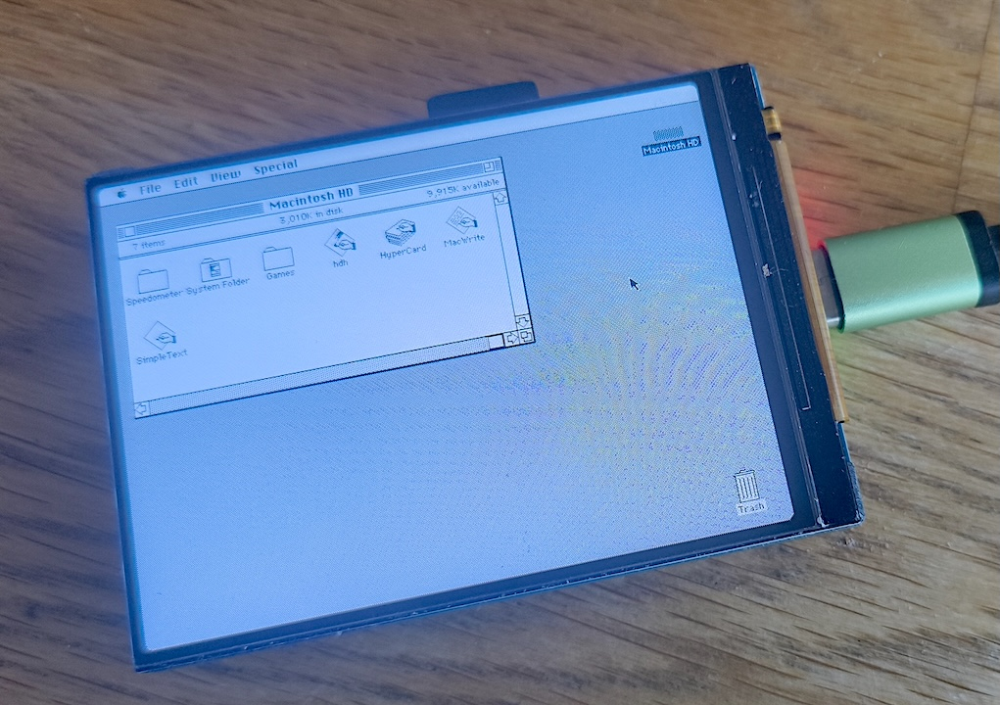
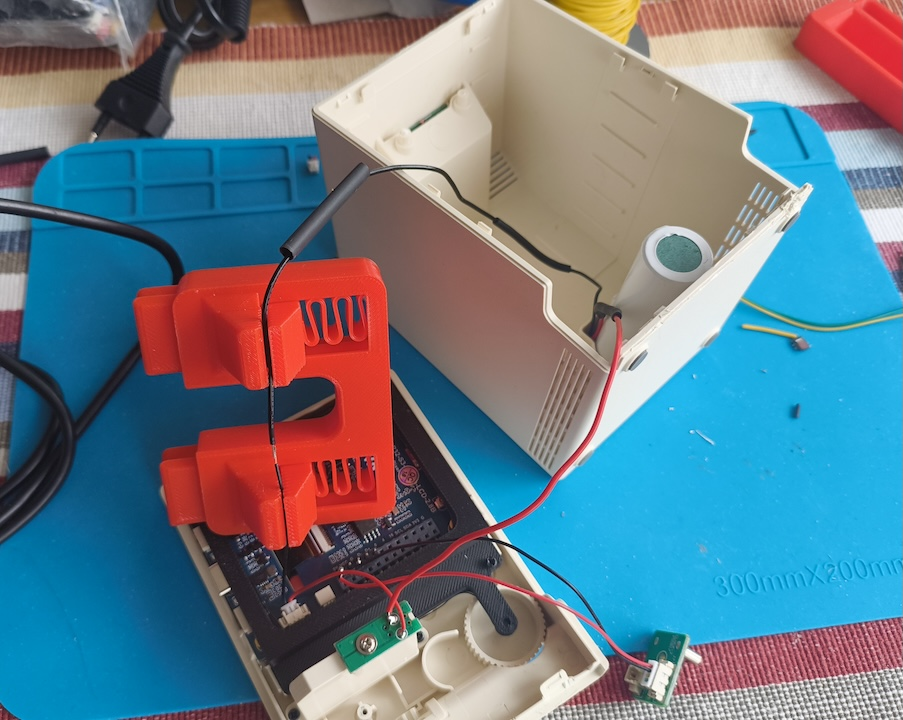
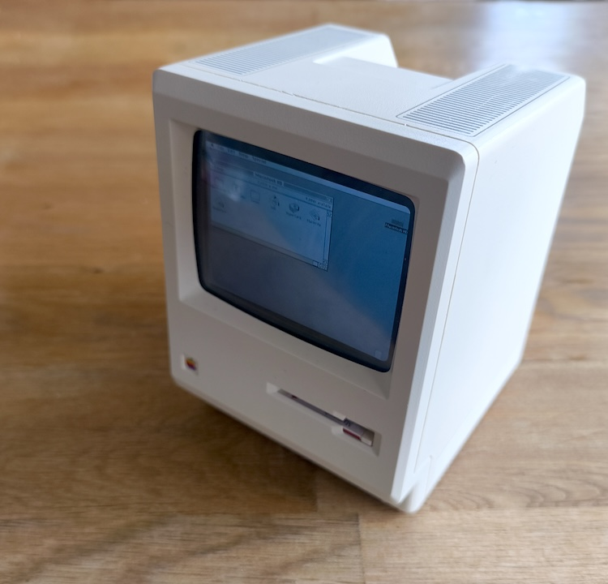

<a href="https://claude.ai"></a>

# Mac Plus Emulator on ESP32-S3



A Macintosh Plus emulator running on the **Waveshare ESP32-S3-Touch-LCD-2.8B** board. Mouse and keyboard input via BLE (Web Bluetooth) with a standalone web UI featuring trackpad, click button, and virtual keyboard.

Based on [Spritetm's minimacplus](https://github.com/Spritetm/minimacplus), adapted for ESP32-S3 with OPI PSRAM and a 480x640 ST7701 RGB display.

## Hardware

- **Board:** Waveshare ESP32-S3-Touch-LCD-2.8B
- **CPU:** ESP32-S3 dual-core 240MHz
- **RAM:** 512KB SRAM + 8MB OPI PSRAM
- **Flash:** 16MB
- **Display:** 480x640 ST7701 RGB LCD
- **Storage:** MicroSD card slot (FAT32, SDMMC 1-bit mode)

## Features

- Musashi 68000 CPU emulator running at ~5.5MHz (~70% of native 7.83MHz)
- 4MB Mac RAM in OPI PSRAM (direct memory-mapped, no cache layer)
- NCR 5380 SCSI with HD from SD card or flash partition
- VIA 6522, Zilog 8530 SCC, IWM (stub)
- Display rotated 90° CW, 1:1 pixel mapping (640x480 patched ROM on 480x640)
- Boot status messages on screen
- PRAM saved to NVS
- BLE GATT server for keyboard/mouse input via Web Bluetooth
- Standalone web UI (`web/index.html`) with trackpad, click button, and virtual keyboard

## Storage: SD Card & Flash

The emulator supports booting from a **MicroSD card** (preferred) or flash partitions (fallback). SD card gives true read/write support for the hard disk image — changes are saved.

### SD card setup (recommended)

Format a MicroSD card as **FAT32** and place these files on it:

| File          | Size   | Description                    |
|---------------|--------|--------------------------------|
| `macplus.rom` | 128KB  | Mac Plus ROM                   |
| `hd.img`      | any    | SCSI hard disk image (writable)|

Insert the card and boot. The emulator loads ROM and HD from the SD card automatically.

### Flash partition setup (fallback)

If no SD card is present, the emulator falls back to flash partitions:

| Name    | Offset     | Size    | Purpose            |
|---------|------------|---------|-------------------|
| factory | 0x10000    | 1.5MB   | Application        |
| rom     | 0x190000   | 128KB   | Mac Plus ROM       |
| hd      | 0x1B0000   | ~14.3MB | SCSI Hard Disk     |

```bash
esptool.py write_flash 0x190000 macplus.rom
esptool.py write_flash 0x1B0000 hd.img
```

Note: flash partition writes require erase cycles and are limited to ~14.3MB.

## Setup

### 1. Build and flash firmware

```bash
pio run -t upload
```

### 2. Provide ROM and HD image

Either place `macplus.rom` and `hd.img` on a FAT32 MicroSD card, or flash them to partitions (see above).

### 3. Create an HD image

A proper SCSI HD image with Apple partition map and driver is required.
Raw HFS/floppy images (from Mini vMac, etc.) will NOT work.

Use MAME to create one:

```bash
# Create blank HD (1.4MB, 2800 blocks)
dd if=/dev/zero of=hd.img bs=512 count=2800

# Boot MAME with System floppy + blank HD
mame macplus -window -flop1 system6.dc42 -hard1 hd.img

# In MAME: use Apple HD SC Setup to initialize, then install System
```

### 4. Web UI (BLE input)

The web UI is a standalone HTML file at `web/index.html`. It connects to the ESP32 over BLE using the Web Bluetooth API.

**Requirements:**
- Chrome (Android, Windows, macOS, Linux) or Edge — Safari and Firefox do not support Web Bluetooth
- The page must be served over HTTPS or from localhost (Web Bluetooth requirement)

A hosted version is available at **https://memention.com/esp32_mac/**

**To use:**
1. Open the hosted version above, or serve `web/index.html` yourself
2. Open the page in Chrome on your phone/computer
3. Tap the gear icon and select **Reconnect BLE**
4. Select **MacPlus** from the browser's Bluetooth pairing dialog

The web UI provides:

- **Trackpad** — touch and drag to move the Mac cursor
- **Click button** — tap for a single click; long press (~400ms) to lock the button down for dragging, tap again to release
- **Virtual keyboard** — tap the keyboard icon to show/hide a full Mac M0110A layout
  - Modifier keys (Shift, Ctrl, Opt, Cmd) are sticky: tap to activate, auto-release after the next key
  - Caps Lock is a true toggle: tap to engage, tap again to disengage
- **Settings** (gear icon) — reconnect/disconnect BLE

## SD Card Pin Mapping

The MicroSD card shares SPI pins with the LCD init (freed after display setup):

| Signal | Pin    | Notes                      |
|--------|--------|----------------------------|
| CLK    | GPIO2  | Shared with LCD SPI CLK    |
| CMD    | GPIO1  | Shared with LCD SPI MOSI   |
| D0     | GPIO42 | SD data line               |
| DAT3   | EXIO4  | IO expander, pulled high   |

Uses SDMMC 1-bit native mode (not SPI mode).

## Credits

- [minimacplus](https://github.com/Spritetm/minimacplus) by Jeroen Domburg (Spritetm)
- [Musashi](https://github.com/kstenerud/Musashi) 68K emulator by Karl Stenerud
